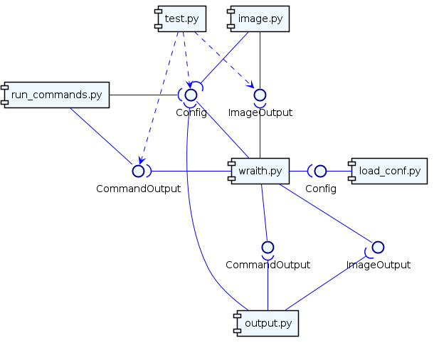
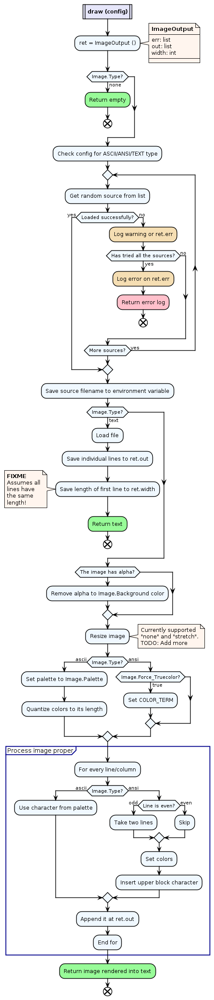

# System Overview

This is an overview of **wraith**'s internals, for programmers. It has limited
usefulness for end users. The readership is expected to know and understand
Python and a basic of Software Engineering.

## Rationale

After several months without touching this code, I felt a need to document how
it worked so I could better understand it and come back to contributing to it.

This means this document is meant mostly for myself, and as such, there's no
strict adherence to any conventions.

## Top-Down View

The code is split in 6 python files (listed alphabetically):

* `image.py`: Handles converting the image to ASCII;

* `load_conf.py`: Handles the TOML configuration file;

* `output.py`: Takes the strings returned from the other modules and displays
  them side by side;

* `run_commands.py`: Runs the external commands and captures their outputs;

* `test.py`: Tests;

* `wraith.py`: Main entry point. Mostly glue code for the other modules.

Other interesting files include the configuration file:

* `config.toml`: The default configuration file that drives the whole thing. To
  be detailed in its own documentation;

* `terroo.toml`: Another configuration file I use sometimes to test stuff. Will
  probably be removed in the final version or maybe kept as an example.

And the images, all of which are used by `test.py`:

* `logo.png`: The wraith logo and default image if none is specified on
  `config.toml`;

* `logo-mini.png`: A smaller version of the above;

* `img.txt`: An "image" in text format. It includes ANSI escape codes.

## Walk Through

TODO

## Detailed View of Individual Files

TODO: Add an in depth explanation of each file.

### image.py

First, we define the return type: an object containing two lists and an
integer (`ImageOutput`). The `err` list will contain each as a tuple with
format (`error type`, `error message`), where `error type` is a single
character, either of `W` for warnings or `E` for errors and `error message` is
a descriptive message. The output will be stored in the list `out`, composed of
strings of same visual length (this value stored in `width`) that shall be
output directly by the appropriate module. The length of the string might not
be the same as the visual length because it may include ANSI escape sequences
to define the colors.

Then we begin the `draw ()` function. It takes the `config` object which
includes all the configurations loaded and everything needed to decide how to
display the image.

The first step is checking if `Image.Type` is `NONE`, in which case it simply
returns an empty `ImageOutput` object. Otherwise it splits the return type into
3 booleans for easier processing. While the diagram above shows conditions
testing `Image.Type` directly, they instead check these booleans: `ansi_type`,
`ascii_type` and `text_type`.

Now it tries loading the source. `Image.Source` might contain a list of
possible sources (TODO: check if single strings are accepted by `load_conf.py`
or only lists). The program tries randomly the sources until it can load one
or fails to load them all, logging failures as warnings and if no sources are
left, it logs an error and returns with an empty output. After successfully
loading a source, its filename is saved to the `WRAITH_IMAGE_SOURCE`
environment variable and can be accessed by the commands that generate the
right hand side of the output.

If the `Image.Type` is `TEXT`, it simply reads it and dump its lines on
`ret.out` and *the width of the first line* into `ret.width`, returning it.
FIXME: make sure it check the width of every line and pad the smaller ones.

For the other types, it then flattens the image's transparent layer, if any,
and resizes it to the desired size. For ANSI type, it resizes to double the
number of lines, since each line will contain two blocks. Some final
adjustments (set Palette for ASCII type or True Color for ANSI) and with all
ready, it begins the final processing.

For every line and then column, generate the corresponding character (with
color sequence, if applicable) and string them together into the full line.
Append it to `ret.out` and then return it. Done.
